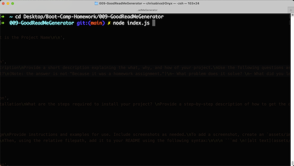
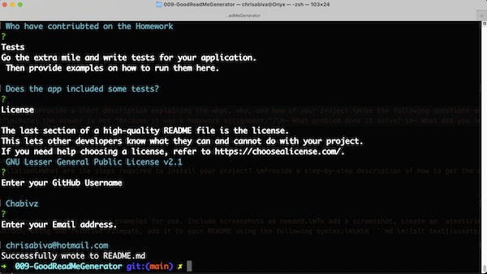

# 009 - GoodReadMeGenerator

The Good ReadMe Generator is a tool for making a good README.file. A README contains information that is commonly required to undestand what the project is about. 

## Table of Contents
- [Installation](#installation)
- [Usage](#usage)
- [Contribution](#contribution)
- [Tests](#tests)
- [Questions](#questions)
- [License](#license)

## Installation
- Install [Node](https://nodejs.org/en/download/)
- Go to [Github Page](https://github.com/Chabivz/009-GoodReadMeGenerator)
- Make sure to add the node packages. 
- Create a package.json file by typing (npm init -y)
- Install Inquirer (npm i inquirer)
= Install Itil package (npm i util)

## Usage
- Go to [Github Page](https://github.com/Chabivz/009-GoodReadMeGenerator)
- The motivation for this project is to be able to create a team in a terminal. 
- To start the project you will have to type node index.js

```bash
node index.js
```
- After you have added all the information in the GoodReadMeGenerator. 
- It will generate a good readMe on the folder Output. 

Mood Tracker Demo \
 \
\
Starting the app \
 \
\
Final input in terminal \
 \

